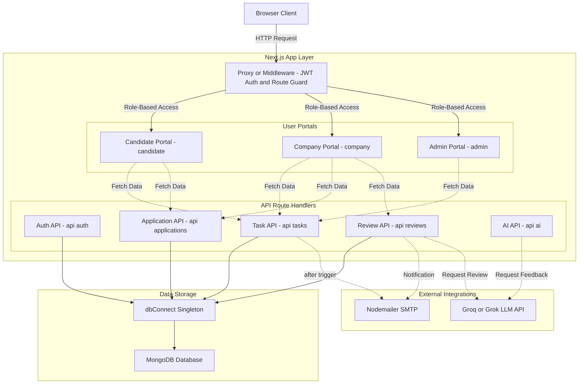
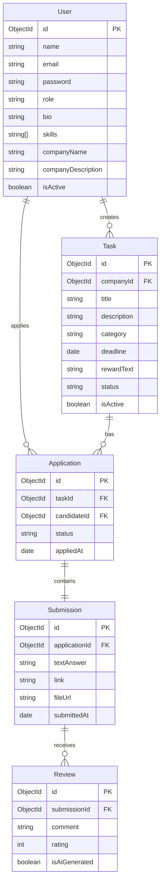

# MicroIntern — Work First. Hire Later.

MicroIntern is a production-grade hiring platform where companies post real, actionable micro-tasks, candidates complete them, and hiring decisions are based on demonstrated execution rather than resumes.

The application has been fully styled to look and feel like a modern, premium, venture-backed SaaS product (using polished styling scales, HSL-tailored colors, Playfair Display heading typography, glassmorphism headers, and smooth micro-animations).

---

## 🛡️ Role-Based Access Controls

The platform implements three separate user portals guarded by a custom JWT-cookie session store in Next.js Edge Middleware:
1. **Candidate Portal (`/candidate/*`)**: Browse open tasks, view timer countdowns, apply to tasks, and submit/modify solution work.
2. **Company Portal (`/company/*`)**: Create tasks with validation, track candidate applications, grade work solutions, and request AI reviews.
3. **Admin Portal (`/admin/*`)**: System-wide moderation to deactivate/reactivate users and tasks instantly.

---

## 🛠️ Tech Stack & Architecture

- **Framework**: Next.js 16 (App Router)
- **Database**: MongoDB (via Mongoose ORM, connection singleton cached globally)
- **Security**: Custom JWT Session in httpOnly secure cookie + `bcryptjs` password hashing
- **Styling**: Tailwind CSS v4 (mapped using `@theme` color tokens, border radii, shadows)
- **Validation**: `react-hook-form` + `zod` schema validations on client and server routes
- **AI Integration**: x.ai (Grok-2) / Groq API integration for generating candidate work feedback with automatic mock engine degradation fallback

### 🏗️ Architecture Diagram


<details>
<summary>Show Mermaid Code Source</summary>



</details>

### 📊 Entity-Relationship (ER) Diagram


<details>
<summary>Show Mermaid Code Source</summary>



</details>

---

## 🗄️ Database Schemas (Mongoose)

### 1. User
- `name` (String, required): Profile name or contact representative.
- `email` (String, required, unique, lowercase): Login email.
- `password` (String, required): Bcrypt-hashed password.
- `role` (enum: `'candidate' | 'company' | 'admin'`): Roles defining route access.
- `bio` (String): Candidate-only summary.
- `skills` (Array of Strings): Candidate-only technical tag list.
- `companyName` (String): Company-only registered name.
- `companyDescription` (String): Company-only tagline.
- `isActive` (Boolean, default `true`): Administrative moderation flag.

### 2. Task
- `companyId` (ObjectId -> User, required): Reference to the creator company.
- `title` (String, required): Task headline.
- `description` (String, required): Complete criteria description (max 3000 chars).
- `category` (String, required): Skill categorizations.
- `deadline` (Date, required): Expiration date-time.
- `rewardText` (String): Display stipend/incentive.
- `status` (enum: `'open' | 'closed'`): Open/Closed states.
- `isActive` (Boolean, default `true`): Admin block state.

### 3. Application
- `taskId` (ObjectId -> Task, required): Targeted task posting.
- `candidateId` (ObjectId -> User, required): Applied candidate.
- `status` (enum: `'Applied' | 'Reviewed' | 'Shortlisted' | 'Interview' | 'Offered' | 'Rejected'`): Recruitment pipeline.
- `appliedAt` (Date): Time of application.
- *Unique compound index*: `(taskId, candidateId)` to prevent double applications.

### 4. Submission
- `applicationId` (ObjectId -> Application, required, unique): Linked application.
- `textAnswer` (String, required): Text explanation of solution.
- `link` (String): Solution URL (Github, Figma, etc.).
- `fileUrl` (String): Reference to local/cloud uploaded file paths.
- `submittedAt` (Date): Submission timestamp.

### 5. Review
- `submissionId` (ObjectId -> Submission, required): Reviewed candidate submission.
- `comment` (String, required): Assessment text comment.
- `rating` (Number, 1-5, required): Performance scale.
- `isAiGenerated` (Boolean, default `false`): Flag for Grok AI assessments.

---

## ⚡ Setup & Run Instructions

### 1. Environment Configuration
Copy `.env.local.example` to `.env.local` and configure your credentials:
```bash
cp .env.local.example .env.local
```

### 2. Install Dependencies
```bash
npm install
```

### 3. Seed Database
Run the seed script to clean old tables and populate sample administrators, companies, candidates, tasks, and applications:
```bash
npm run seed
```

### 4. Run the Dev Server
```bash
npm run dev
```
Open **[http://localhost:3000](http://localhost:3000)** in your browser.

---

## 📦 Seed Data Credentials

For demonstration and testing purposes, use the following seeded accounts:

- **System Admin**:
  - Email: `admin@microintern.com`
  - Password: `adminpassword123`
- **PixelForge Studio (Company)**:
  - Email: `company1@pixel.com`
  - Password: `password123`
- **QuickCart Technologies (Company)**:
  - Email: `company2@quick.com`
  - Password: `password123`
- **Priya Sharma (Candidate - Front-end)**:
  - Email: `candidate1@priya.com`
  - Password: `password123`
- **Arjun Mehta (Candidate - Data/Python)**:
  - Email: `candidate2@arjun.com`
  - Password: `password123`

---

## 💡 Known Limitations
- **Payments**: Display-only stipend texts. No real transaction gateways.
- **Uploads**: Files are stored as mock path references (e.g. `/public/uploads/...`).
- **Interviews**: Pipeline state updates. No video conference scheduling integrations.
- **SSO/OAuth**: Classic email/password credentials authentication only.
